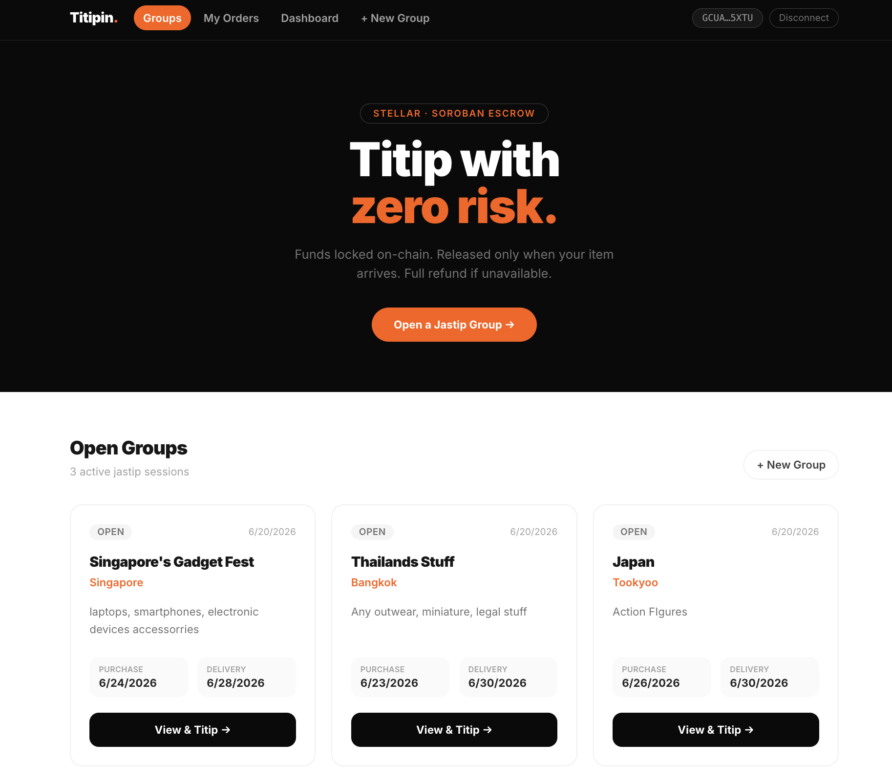
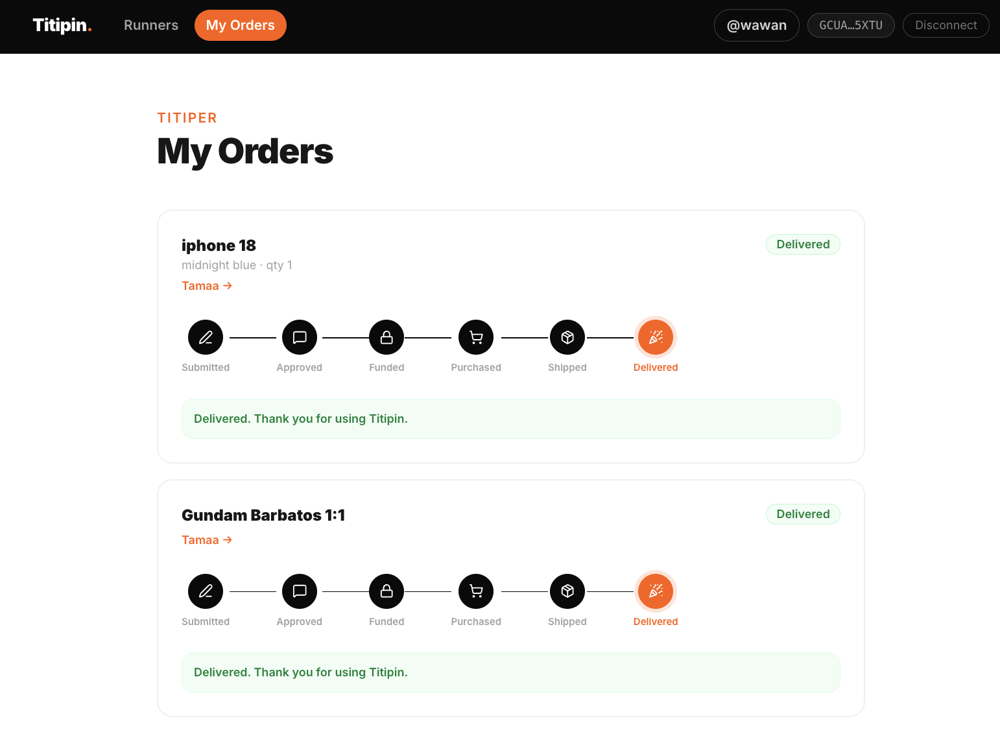
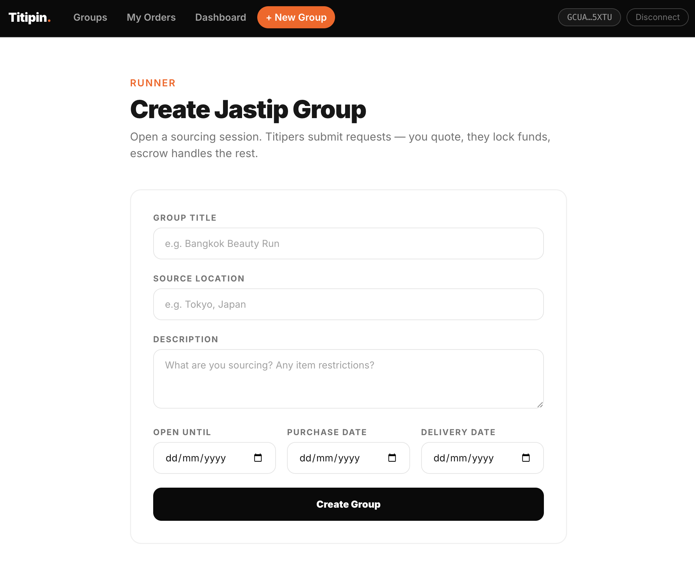

<h1>Titipin</h1>

> ⚠️ This project is under active development. Features, contracts, and interfaces may change at any time.

**Titipin** is a trustless escrow payment platform for jastip transactions on the Stellar blockchain.

---

## What is Jastip?

**Jastip** (short for *jasa titip*, Indonesian for "entrusted shopping service") is a widely-practiced informal commerce model in Indonesia. Here is how it works:

- A **runner** (called a *jastiper*) is traveling abroad or has access to a foreign market — Japan, Korea, Europe, etc.
- They announce where they are going and what they can buy, and take orders from people back home.
- **Buyers** (called *titipers*, from *menitip* — "to entrust something to someone") submit requests for specific items they want: a limited-edition sneaker from Tokyo, a Korean skincare product, a bag not available domestically.
- The runner sources the items, adds their fee on top, and ships everything back.

Jastip is popular because it gives Indonesian buyers access to overseas goods without travelling themselves, and gives runners a way to monetise trips they are already taking. Transactions commonly happen over Instagram DMs or WhatsApp groups — with no payment protection of any kind.

**The problem Titipin solves:** in the current jastip workflow, buyers wire money to the runner upfront and trust them completely. If the item sells out, the runner forgets, or simply disappears, the buyer has no recourse. Titipin fixes this by locking the payment inside a Soroban smart contract on Stellar. The runner never touches the money until the buyer confirms delivery. If the item cannot be sourced, the contract automatically returns the funds to the buyer — no negotiation, no goodwill required.

---

## Recent Updates

Titipin has moved from timed *"titip groups"* to a persistent **runner marketplace** with lightweight accounts and off-platform chat. On-chain stays minimal — only the money moves through the contract.

- **Accounts & onboarding** — Every wallet gets a lightweight account (just a username) on first connect. No profile forms required just to browse.
- **Runner profiles** — *Become a Runner* upgrades an account into a full profile: username, current location, background, WhatsApp number, and a **Ready / Not Ready** toggle. One profile per wallet; titipers browse only runners who are *Ready*.
- **WhatsApp click-to-chat** — Each runner lists a WhatsApp number. Titipers tap **Chat** to negotiate price, shipping, and item details directly — no bot, no backend, just a `wa.me` deep link.
- **Landing page** — Visitors who haven't connected a wallet see a marketing landing page (what Titipin is + how it works) instead of the runner list.
- **Runner-set pricing** — Removed the titiper's price-estimate field; the runner sets the price when quoting.
- **Off-chain shipping status** — *Mark Shipped* + tracking number are saved to Supabase (instant, no gas). Only fund / confirm / refund stay on-chain, since only the money needs trust enforcement.

---

## Screenshots

| Group List | My Orders |
|---|---|
|  |  |

| Submit Request | Create Group |
|---|---|
|  |  |

---

## How It Works

```
Titiper browses Ready runners → chats on WhatsApp to agree on the item
              │
              ▼
Titiper submits a request to that runner
              │
              ▼
Runner reviews and sends an all-in quote
(item cost + taxes + import duties + shipping + runner fee)
              │
              ▼
Titiper approves → locks the exact quoted amount in the smart contract
              │
        ┌─────┴──────┐
        │             │
  Item delivered   Item unavailable
        │             │
        ▼             ▼
  Titiper confirms   Contract refunds
  receipt → funds    full amount to
  released to runner  titiper instantly
```

Neither party can move the funds unilaterally. All rules are enforced by the Soroban contract on Stellar.

---

## Features

- **Runner marketplace & profiles** — Runners publish a profile (username, location, background, WhatsApp, Ready toggle). Titipers browse *Ready* runners and submit item requests.
- **Lightweight accounts** — Every wallet gets an account (username) on first connect; *Become a Runner* upgrades it to a full profile. One account per wallet.
- **WhatsApp chat** — Titipers negotiate price, shipping, and item details directly with the runner via a `wa.me` click-to-chat link — no bot or backend.
- **Escrow-backed payments** — Funds are locked in a Soroban smart contract on Stellar testnet. Nobody can access them until the outcome is settled.
- **All-in runner quote** — Runners set a single total price covering the item, local taxes (e.g. Japan consumption tax), Indonesian import duties, shipping, and their own margin. No hidden fees.
- **Live status tracker** — A visual tracker (Submitted → Approved → Funded → Purchased → Shipped → Delivered) updates in real-time via Supabase Realtime for both parties without page refresh.
- **Off-chain shipping** — Purchased/Shipped status and the tracking number are stored in Supabase (no gas). Only fund / confirm / refund touch the chain.
- **Freighter wallet** — On-chain transactions (escrow funding, release, refund) are signed by the user's Freighter wallet. No private keys are stored by the app.
- **Cross-device visibility** — Account and request data is stored in Supabase (PostgreSQL), visible across any browser, device, or Chrome profile.

---

## Smart Contract — `titipin-escrow`

**Deployed on Stellar Testnet:**

| Contract | ID |
|---|---|
| `titipin-escrow` | `CAB5LP5SKD22NA6SECD6EV3AJ62BWYV5MNRRELCHVKF5DX6IUQADSXBB` |
| `runner-reputation` | `CBQ5YNUFSK5WDJMS6XGX22RWW54IJ3CQFXBWSDQBN4DTPHCFTLXPBLPG` |

The contract is written in Rust using the Soroban SDK and stores one `EscrowRequest` record per titip request on the Stellar ledger.

### On-chain data

```rust
pub struct EscrowRequest {
    pub runner:  Address,   // runner's Stellar wallet
    pub titiper: Address,   // titiper's Stellar wallet
    pub token:   Address,   // XLM token contract address
    pub amount:  i128,      // locked amount in stroops (1 XLM = 10,000,000 stroops)
    pub status:  EscrowStatus,
}

pub enum EscrowStatus {
    Registered,  // runner approved, waiting for titiper payment
    Funded,      // titiper locked funds
    Completed,   // titiper confirmed receipt, runner paid out
    Refunded,    // item unavailable, titiper refunded
}
```

### Contract functions

| Function | Who calls it | What it does |
|---|---|---|
| `create_request(id, runner, titiper, token, amount)` | Runner | Registers escrow terms on-chain. Locks in the amount and both parties' addresses. Must be called before the titiper can fund. |
| `fund_request(id, titiper)` | Titiper | Transfers XLM from the titiper's wallet into the contract. Status moves to `Funded`. |
| `confirm_receipt(id, titiper)` | Titiper | Releases the locked XLM from the contract to the runner's wallet. Status moves to `Completed`. |
| `refund_request(id, runner)` | Runner | Returns the locked XLM to the titiper's wallet. Called when the item is unavailable. Status moves to `Refunded`. |
| `get_request(id)` | Anyone | Read-only. Returns the current on-chain state of a request. |

All state-changing functions require the caller's Freighter wallet signature (`require_auth`). The contract enforces that only the correct party (runner or titiper) can call each function.

---

## Project Structure

```
.
├── contracts/
│   ├── hello-world/            # Starter example (unused)
│   ├── xlm-fund/               # Simple deposit vault (prototype)
│   └── titipin-escrow/         # Production escrow contract
│       ├── src/
│       │   ├── lib.rs          # Contract logic (create, fund, release, refund)
│       │   └── test.rs         # Unit tests (happy path + refund path)
│       └── Cargo.toml
│
├── frontend/                   # React + TypeScript + Vite
│   ├── src/
│   │   ├── contract/           # Soroban contract service layer
│   │   ├── features/           # UI feature components (groups, requests, escrow)
│   │   ├── hooks/              # React hooks with Supabase Realtime subscriptions
│   │   ├── lib/                # Storage (Supabase), roles, pricing helpers
│   │   ├── pages/              # Route-level pages
│   │   ├── types/              # TypeScript types (Group, Request, Wallet)
│   │   └── wallet/             # Freighter wallet context
│   ├── bindings/               # Auto-generated TypeScript bindings from Soroban CLI
│   └── public/
│       └── favicon.svg
│
├── Cargo.toml                  # Rust workspace
└── README.md
```

---

## Setup

### Prerequisites

| Tool | Version | Install |
|---|---|---|
| Rust | stable | [rustup.rs](https://rustup.rs) |
| Stellar CLI | latest | `cargo install --locked stellar-cli --features opt` |
| wasm32 target | — | `rustup target add wasm32-unknown-unknown` |
| Node.js | 18+ | [nodejs.org](https://nodejs.org) |

### 1 — Clone and install

```bash
git clone https://github.com/Pradypta/stellar-project-01
cd stellar-project-01

# Frontend dependencies
cd frontend && npm install && cd ..
```

### 2 — Set up Supabase

1. Create a free project at [supabase.com](https://supabase.com)
2. Open the **SQL Editor** and run:

```sql
-- One row per wallet — an account, upgraded to a runner profile when is_runner = true.
-- (Table name is historical; `title` holds the username, `source_location` the location,
--  and `description` the runner background.)
create table titipin_groups (
  group_id          text primary key,   -- = wallet address (one row per wallet)
  runner_address    text not null,
  title             text not null,       -- username
  source_location   text default '',     -- current location
  description       text default '',     -- background / about the runner
  whatsapp_number   text default '',     -- international format, for click-to-chat
  is_runner         boolean not null default false,
  group_status      text not null default 'not_ready',  -- 'ready' | 'not_ready'
  fee_percentage    integer not null default 10,
  created_at        text not null
);

create table titipin_requests (
  request_id        text primary key,
  group_id          text not null references titipin_groups(group_id),
  titiper_address   text not null,
  runner_address    text not null,
  item_name         text not null,
  item_link         text default '',
  variant           text default '',
  quantity          integer not null default 1,
  notes             text default '',
  estimated_price   numeric,             -- unused (runner sets the price when quoting)
  runner_quote      numeric,
  request_status    text not null default 'submitted',
  status_updated_at text,
  tracking_number   text,                -- courier tracking, saved off-chain on Mark Shipped
  created_at        text not null
);

-- Public read/write (wallet address = identity for MVP)
alter table titipin_groups  enable row level security;
alter table titipin_requests enable row level security;

create policy "public read"   on titipin_groups  for select using (true);
create policy "public insert" on titipin_groups  for insert with check (true);
create policy "public update" on titipin_groups  for update using (true);

create policy "public read"   on titipin_requests for select using (true);
create policy "public insert" on titipin_requests for insert with check (true);
create policy "public update" on titipin_requests for update using (true);

-- Enable Realtime for live status updates
alter publication supabase_realtime add table titipin_requests;
```

3. Go to **Project Settings → API** and copy your **Project URL** and **anon key**.

### 3 — Configure environment

```bash
cp frontend/.env.example frontend/.env
```

Edit `frontend/.env`:

```env
VITE_STELLAR_NETWORK_PASSPHRASE="Test SDF Network ; September 2015"
VITE_STELLAR_RPC_URL=https://soroban-testnet.stellar.org
VITE_STELLAR_CONTRACT_ID=CB4YBYZMZITNAGE2U3LCA3WPUHGXJGWVZ7Z2PKB3S3ZUBPUVXZQALEKB

VITE_SUPABASE_URL=https://your-project.supabase.co
VITE_SUPABASE_ANON_KEY=your-anon-key
```

### 4 — Install Freighter wallet

Install the [Freighter browser extension](https://www.freighter.app), create a wallet, and switch the network to **Testnet**. Fund your wallet at [Stellar Friendbot](https://laboratory.stellar.org/account-creator).

### 5 — Run the frontend

```bash
cd frontend && npm run dev
```

Open [http://localhost:5173](http://localhost:5173).

---

## Usage

### As a Runner (jastiper)

1. Connect Freighter wallet and set a username when prompted
2. Tap **Become a Runner** and fill your profile — location, WhatsApp number, background
3. Set your status to **Ready** so titipers can find you under **Runners**
4. Titipers chat with you on WhatsApp to agree on the item, price, and shipping
5. When a request comes in, review it and enter your all-in quote (item + taxes + duties + shipping + your margin)
6. Approving a request signs an on-chain transaction via Freighter — this registers the escrow terms
7. Update status as you progress: **Purchased → Shipped** (enter the tracking number — saved off-chain)
8. Once the titiper confirms delivery, escrow releases the funds to your wallet

### As a Titiper (buyer)

1. Connect Freighter wallet and set a username when prompted
2. Browse **Ready runners** on the home page; tap **Chat** to negotiate on WhatsApp
3. Open a runner and submit your request (item name, link, variant, quantity)
4. Wait for the runner to approve and send a quote
5. Review the all-in quote — it covers everything. Click **Lock XLM** to fund escrow via Freighter
6. Track your order in **My Orders** — it updates live, with the tracking number once shipped
7. When your item arrives, click **I received my item** to release funds to the runner

---

## Building & Testing the Contract

```bash
# Run unit tests
cargo test -p titipin-escrow

# Build WASM
stellar contract build --package titipin-escrow

# Deploy to testnet (requires a funded identity)
stellar keys generate deployer --network testnet --fund
stellar contract deploy \
  --wasm target/wasm32v1-none/release/titipin_escrow.wasm \
  --source deployer \
  --network testnet

# Regenerate TypeScript bindings after deployment
stellar contract bindings typescript \
  --contract-id <NEW_CONTRACT_ID> \
  --network testnet \
  --output-dir /tmp/titipin-bindings
cp /tmp/titipin-bindings/src/index.ts frontend/src/bindings/titipin-escrow.ts
```

---

## Tech Stack

| Layer | Technology |
|---|---|
| Smart contract | Rust + Soroban SDK v26 |
| Blockchain | Stellar Testnet |
| Wallet | Freighter |
| Frontend | React 19 + TypeScript + Vite |
| Styling | Tailwind CSS v4 |
| Database | Supabase (PostgreSQL + Realtime) |
| Icons | Lucide React |

---

## Roadmap

- [ ] Dispute resolution mechanism
- [ ] Runner reputation / rating system
- [ ] Group search and filtering
- [ ] Push notifications on status change
- [ ] Mainnet deployment
- [ ] Mobile app (React Native)
